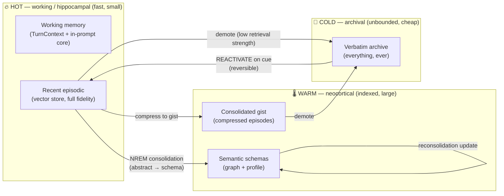
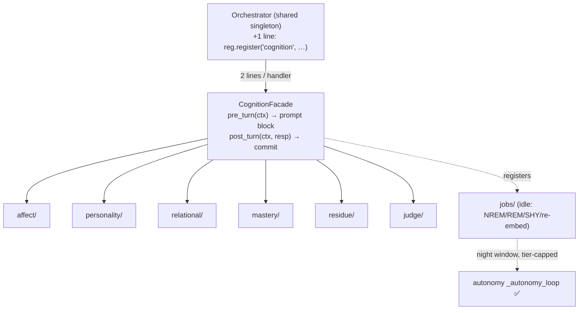

# Jarvis Cognition — Living Memory & Human-Like Personality

> **Schematic & diagnostic map** for the `cognition` subsystem (planned **ORIZONT 21**).
> Companion to `ARCHITECTURE.md` (where code lives) and `VOICE.md`. This doc is the
> place to look when memory or personality misbehaves: it maps every component to a
> **brain analogy**, a **module**, a **store**, a **settings flag**, and a
> **failure → fix**. Read §1–§3 for the model, §7–§8 to diagnose.
>
> Status legend: ✅ exists today · 🟡 extends existing · 🟢 greenfield (planned).

---

## 1. Design principles (non-negotiable)

1. **Unbounded & append-only — the brain never hits a delete wall.** Memory capacity
   is *not* a managed limit. Nothing is ever auto-deleted. "Forgetting" = reduced
   **accessibility** (retrieval strength) + **tier demotion**, never erasure — and it
   is **reversible** (the right cue reactivates a cold memory, exactly as in human recall).
   The **only** true erase is the user's explicit *forget* (the inspectable/forgettable
   principle). Volume is handled by **tiering + compression + nightly renormalization**,
   not by throwing memories away.
2. **Forever-valuable — value compounds with size.** Because consolidation abstracts
   episodes into reusable schemas and **synaptic-homeostasis renormalization** (§5) keeps
   signal-to-noise high at any scale, a bigger store gets *more* useful over time, not
   slower or noisier.
3. **Future-proof / neuroplastic — improves as technology improves.** The architecture
   is storage- and model-agnostic so it *automatically exploits* better embeddings,
   bigger context windows, cheaper storage, and faster hardware as they arrive. Every
   trace records its **embedding-model version**; a background **re-projection** job
   (cortical remapping / neuroplasticity) upgrades old memories to new models during idle.
   Working memory is **context-window-elastic**. See §6.
4. **Local-first & honesty-anchored.** Everything runs on owned hardware; honesty
   (HEXACO Honesty-Humility) is structurally protected (§7 anti-sycophancy).
5. **Gated, default-OFF, no-op when off.** One `cognition` settings category; master
   `cognition.enabled=false` makes the whole subsystem a measurable no-op (zero hot-path cost).
6. **No god-object growth.** All logic in `agents/core/cognition/`; the orchestrator
   touches it through **one** registered facade (§4). No new routes in `web.py`.

---

## 2. The brain analogy master table

The cognition subsystem is modeled on the brain as literally as is useful. Each row is a
diagnostic anchor: if a *function* misbehaves, this is the *module/store/flag* to inspect.

| # | Brain structure / process | Neuro function | Jarvis analog | Module (planned/✅) | Store | Flag |
|---|---|---|---|---|---|---|
| 1 | **Thalamus / sensory register** | Relay + attention gating into awareness | Channel intake + salience gate on what enters working memory | `channels/`, `cognition/affect` 🟢 | — | `cognition.affect_enabled` |
| 2 | **Prefrontal cortex / working memory** | Hold + manipulate active info; executive | Working-memory manager + per-turn `TurnContext` (OS-style paging) | `cognition/facade` 🟢, orchestrator prompt build ✅ | in-prompt (transient) | `cognition.enabled` |
| 3 | **Global Workspace** (Baars/Dehaene) | Broadcast salient content to all modules | Shared prompt context every agent sees | orchestrator `_gather`/`_synthesize` ✅ | — | — |
| 4 | **Hippocampus (DG / CA3)** | Fast episodic binding; pattern **separation** on write, **completion** on read | Episodic vector store + index; orthogonalize near-dups on write, low-threshold completion on read | `memory/store.py` ✅, `manager.py` ✅, `fusion.py` 🟡 | vector store (hot) | `MEMORY_EMBED_TURNS` |
| 5 | **Entorhinal cortex / grid & time cells** | Index gateway; temporal context | Indexing layer + **Temporal-Context-Model** recall re-rank | `cognition/memory`, post-rank in `fusion.py` 🟡 | `temporal_context` in metadata | `cognition.memory_tcm_enabled` |
| 6 | **Neocortex** | Slow, distributed semantic schemas | Knowledge graph + profile + consolidated semantic store | `memory/graph.py` ✅, `consolidation.py` ✅ | graph / Neo4j + profile | — |
| 7 | **Amygdala** | Emotional salience tagging; strengthens memory | Affect-weighted salience on encode (NE channel) | `cognition/affect` 🟢 → memory encode | `salience` in metadata | `cognition.affect_enabled` |
| 8 | **Basal ganglia / striatum** | Procedural memory, habit, RL action-selection | Skills + self-writing skill loop + learning RL | `skills/loader.py` ✅, `learning/loop.py` 🟡 | `skills/`, `learning/kc.db` 🟢 | `learning.auto_promote` |
| 9 | **Cerebellum** | Forward models; error-correction timing | Predictive-coding encode gate + calibration | `cognition/mastery` 🟢, memory encode | `kc.db` | `cognition.predictive_gate_enabled` |
| 10 | **Default Mode Network** | Self-reflection, autobiography, future simulation, "rest" activity | **Idle/night cortex**: consolidation, narrative, prospective planning | `autonomy/reflection.py` 🟡, `cognition/jobs` 🟢 | — | `system.reflection_enabled`, `cognition.idle_*` |
| 11 | **Dopamine** | Novelty / reward / **prediction error** | DA salience channel + reinforcement signal | `cognition/affect` 🟢 | salience vec | — |
| 12 | **Norepinephrine** | Arousal / urgency salience | NE channel from watchers (deadlines, alerts) | `autonomy/watchers.py` ✅ + affect | — | — |
| 13 | **Acetylcholine** | Encode-vs-consolidate mode; attention | Day/night operating-mode switch | `cognition/jobs`, `is_night_window` ✅ | — | `autonomy.night_shift` |
| 14 | **Serotonin** | Mood, patience, risk tolerance | Mood valence → modulates risk/verbosity | `cognition/affect/mood` 🟢 | mood store | `cognition.affect_enabled` |
| 15 | **Oxytocin** | Social bonding / trust | Per-(agent,user) relational/attachment layer | `cognition/relational` 🟢 | relational store | `cognition.relational_enabled` |
| 16 | **Synaptic plasticity** (LTP/LTD, Hebbian, STDP) | Strengthen co-active, weaken unused | Associative links + retrieval-strength decay (ACT-R) | `memory/decay.py` ✅, link graph | decay store | — |
| 17 | **Synaptic tagging & capture** | Weak memory rescued if strong one lands nearby in time | Tag-and-capture nightly pass within an event window | `cognition/jobs` 🟢 | — | `cognition.idle_consolidation_enabled` |
| 18 | **Metaplasticity** | Learning rate adapts to history | Adaptive consolidation thresholds per domain | `cognition/mastery` 🟢 | `kc.db` | — |
| 19 | **Sleep — NREM slow-wave** | Systems consolidation + replay | NREM pass: episodic→semantic abstraction + replay | `reflection._nrem` 🟡 | — | `cognition.idle_consolidation_enabled` |
| 20 | **Sleep — REM** | Integration, emotional processing, creative recombination | REM pass: cross-memory link discovery + emotional residue | `reflection._rem` 🟡 | — | `cognition.idle_consolidation_enabled` |
| 21 | **Synaptic homeostasis (SHY)** | Nightly **downscaling** keeps signal-to-noise | Retrieval-strength **renormalization** pass (keeps store navigable at any size) | `cognition/jobs` 🟢 | decay store | `cognition.idle_homeostasis_enabled` |
| 22 | **Microglia / astrocytes** | Pruning & housekeeping (no memory loss) | Index compaction, gist compression, **tier demotion** (never delete) | `cognition/jobs` 🟢, memory tiers | archival store | `cognition.idle_maintenance_enabled` |
| 23 | **Neurogenesis (dentate gyrus)** | New neurons aid pattern separation | New index shards as the store grows | `memory/store` sharding 🟡 | — | — |
| 24 | **Neuroplasticity / cortical remapping** | Reorganization, relearning | **Re-embed / re-index** cold memories when a better model arrives (future-proofing) | `cognition/jobs` re-projection 🟢 | `embed_version` in metadata | `cognition.reembed_enabled` |
| 25 | **Memory reconsolidation** | Recalled memory becomes labile → updatable | Update-on-recall + belief revision | `memory/bitemporal.py` ✅ + consolidation | bitemporal store | — |
| 26 | **Gist vs verbatim** (fuzzy-trace) | Meaning trace vs detail trace | Tiered detail: gist hot, verbatim cold (both kept) | memory tiers 🟢 | tiered stores | — |
| 27 | **Sparse distributed coding / engrams** | Efficient trace at scale | ANN sparse vector indices | `memory/qdrant_store.py` ✅ | vector backend | `VECTOR_BACKEND` |
| 28 | **Prospective memory** | Remembering to act in future | Reminders + autonomy task queue | `autonomy/queue.py` ✅ | `autonomy.db` | — |
| 29 | **Theory of Mind / mirror neurons** | Model others' beliefs/goals | User model (1st/2nd order) | `cognition/relational` 🟢 + profile | profile/relational | `cognition.relational_enabled` |
| 30 | **Metacognition (PFC)** | Feeling-of-knowing, confidence | Calibration + reliable abstain ("I don't know") | `cognition/mastery` 🟢, `memory/metamemory` 🟢 | `kc.db` | `cognition.calibration_enabled` |
| 31 | **Inhibition (PFC)** | Suppress inappropriate responses | Guardrails + anti-sycophancy judge | `cognition/judge` 🟢, `security/guardrails.py` ✅ | — | `cognition.anti_sycophancy_enabled` |
| 32 | **Corpus callosum / hemispheres** | Inter-region comms; specialization | Multi-agent handoff + synthesis | orchestrator `synthesize` ✅ | — | — |
| 33 | **Connectome (small-world net)** | Network topology of knowledge | Knowledge-graph topology | `memory/graph.py` ✅ | graph | — |
| 34 | **Reticular activating system** | Global wake/sleep arousal state | Day/night operating mode | `is_night_window` ✅ | — | `autonomy.night_shift` |
| 35 | **Predictive coding / free energy** (Friston) | Minimize prediction error globally | Store residuals; predict-then-correct everywhere | `cognition` encode gate 🟢 | — | `cognition.predictive_gate_enabled` |

---

## 3. Memory tiers — unbounded, never-delete, accessibility-managed



**Key rule:** demotion ⬇ is **never deletion** — it lowers accessibility and moves the
trace to cheaper storage. A strong retrieval cue pulls a cold memory back to hot (human
recall of an old memory). The store grows forever; only the *user* can truly erase.

---

## 4. Wiring — one facade, no god-object growth



- **State model (fixes BUG-5):** transient per-turn state rides `TurnContext`
  (resolved `session_id`/`agent_id`/`user_id` + affect snapshot); **durable** signals live
  in locked, keyed `JsonStore` subclasses keyed by `(agent_id,user_id)` / `session_id`.
  **Never** store affect/personality as orchestrator or `Agent` instance attributes — the
  `Agent` is shared across concurrent turns and would race.
- **Master-off path is a true no-op** — `pre_turn` returns "", `post_turn` does nothing.

---

## 5. Data flow

### Per-turn (hot path — must stay cheap)
```
handle_input / handle_input_stream
  1. resolve TurnContext (session/agent/user)        ← fixes BUG-5
  2. facade.pre_turn(ctx):
       • sample personality STATE from {μ,σ,skew} shifted by current MOOD
       • read affect snapshot, status, Objective·Obstacle·Tactic
       • return a deterministic prompt BLOCK  (spliced like _recall_block)   [BOTH prompt builders]
  3. LLM generate  (+ optional in-character rehearsal draft→critique)
  4. deliver (+ trait/affect → prosody; affect folded into TTS cache key)
  5. facade.post_turn(ctx, response):   ── offloaded via asyncio.to_thread ──
       • write emotional residue (session-scoped)
       • update mood (attractor relax toward setpoint)
       • salience-tag + encode memory (predictive-coding gate: store the surprise)
       • DEFERRED: anti-sycophancy / persona judge (off the request ring)
```

### Nightly (idle cortex — the DMN / sleep cycle)
```
_autonomy_loop  (night window, tier ≤ 1, gated, asyncio.to_thread)
  • NREM  → abstract episodic → semantic schemas; replay; synaptic tag-&-capture
  • REM   → cross-memory link discovery; emotional processing; narrative-identity update
  • SHY   → renormalize retrieval strengths (signal-to-noise at any scale)
  • MAINT → compaction, gist compression, tier demotion (NEVER delete)
  • RE-EMBED → re-project cold memories onto newest embedding model (neuroplasticity)
  • LEARN → deliberate practice on weakest KCs; stale/contradicted-fact retirement
  • SELF  → psychometric self-test (drift tripwire); slow bounded personality drift
```

---

## 6. Future-proofing (the "valuable over time" guarantees)

| Tech improves… | Brain analogy | Mechanism | Diagnostic |
|---|---|---|---|
| Better embedding model | Cortical remapping | Each trace stores `embed_version`; nightly **re-projection** upgrades old vectors; mixed generations coexist and are re-ranked compatibly | check `embed_version` distribution; run `cognition.reembed` |
| Bigger context window | Larger working memory | Working-memory manager is **elastic** — uses as much context as the model exposes (caps from settings, not hard-coded) | check `cognition.working_set_tokens` vs model limit |
| Cheaper / faster storage | More cortex | Tiering thresholds are settings; cold tier can be any backend (local SSD → object store) | check tier backend config |
| Faster / bigger local model | Faster cortex | Existing hybrid router auto-detects loaded model; deep-slot escalation already present | `/api/llm/...` model report |
| New vector DB | Neurogenesis (capacity) | `VECTOR_BACKEND` is pluggable (memory/Qdrant today); add backends behind the same interface | `VECTOR_BACKEND` setting |

**No hard caps.** Any limit (working-set tokens, tier sizes, consolidation batch) is a
*setting with a generous default*, never a structural ceiling.

---

## 7. Component reference — diagnostic columns

| Component | Brain analog | File (planned) | Store / path | Flag | Common failure → fix |
|---|---|---|---|---|---|
| **Facade** | PFC executive | `cognition/facade.py` | — | `cognition.enabled` | Subsystem inert → master flag off; or registry import failed (check `/api/cognition/status`) |
| **Affect / mood** | Amygdala + serotonin | `cognition/affect/` | mood store (keyed) | `cognition.affect_enabled` | Flat tone → flag off; **stuck mood** → τ/clamp wrong, reset via `/api/personality/mood/reset` |
| **Personality sampler** | Whole-trait dynamics | `cognition/personality/` | SOUL `meta` + state in TurnContext | `cognition.affect_enabled` | No variation → `σ`=0; drift → see drift job |
| **Relational** | Oxytocin / ToM | `cognition/relational/` | relational store `(agent,user)` | `cognition.relational_enabled` | Over-adaptation (mirroring) → delta norm cap exceeded; reset delta |
| **Mastery / calibration** | Cerebellum + metacognition | `cognition/mastery/` | `learning/kc.db` | `cognition.calibration_enabled` | Overconfident → too few samples (Wilson bound); recompute |
| **Judge (anti-sycophancy)** | PFC inhibition | `cognition/judge/` | — | `cognition.anti_sycophancy_enabled` | Flattery slipping through → judge unwired at registration; Sycophancy Index rising |
| **Encode gate** | Predictive coding | `memory/manager.add_turn` 🟡 | vector metadata | `cognition.predictive_gate_enabled` | Junk residuals → embed backend on **hash fallback** (backend down) |
| **Consolidation (NREM/REM)** | Sleep | `autonomy/reflection.py` 🟡 | graph + stores | `cognition.idle_consolidation_enabled` | Didn't run → `_last_run` stuck / night window / tz; force via `/api/reflection/run` |
| **Homeostasis (SHY)** | Sleep downscaling | `cognition/jobs/` | decay store | `cognition.idle_homeostasis_enabled` | Recall noisy at scale → renormalization not running |
| **Maintenance** | Glial pruning | `cognition/jobs/` | archival | `cognition.idle_maintenance_enabled` | Slow/large hot tier → compaction/demotion not running (NOT a delete) |
| **Re-projection** | Neuroplasticity | `cognition/jobs/` | `embed_version` | `cognition.reembed_enabled` | Old memories poorly recalled after model upgrade → re-embed pending |
| **Skill loop** | Basal ganglia | `skills/loader.py` 🟡 | `skills/` (versioned) | `learning.auto_promote` | Self-edit broke things → regression gate skipped / no Docker → auto-revert to last green |

---

## 8. Troubleshooting playbook

| Symptom | Probable cause | Where to look | Remedy |
|---|---|---|---|
| Recall returns irrelevant / garbage | Embedding backend down → deterministic **hash fallback** corrupts vectors | logs for "hash fallback"; `EMBED_BACKEND`; `/api/memory/search` | restore embed backend; the encode gate should **flag** fallback mode and skip salience scoring |
| "Forgets" something it should know | Retrieval strength decayed without reinforcement, or demoted to cold tier and not reactivated | `decay` store activation; spaced-reinforcement job ran?; tier of the trace | run `reinforce` job; verify cold→hot **reactivation on cue** is wired; lower decay rate |
| Nightly consolidation didn't happen | `_last_run` idempotency stuck (non-durable), night window/flag off, or wrong tz | `system.reflection_enabled`, `cognition.idle_consolidation_enabled`, `general.timezone`, persisted `_last_run` | `/api/reflection/run` (resets `_last_run`); fix tz; confirm durable idempotency landed |
| Personality feels flat / robotic | `cognition.enabled` or `affect_enabled` off; `σ`=0 in SOUL `meta` | `/api/cognition/status`; SOUL front-matter | enable flags; set non-zero per-facet `σ` |
| Mood "stuck" (sulking / over-warm) | Attractor not decaying; clamp/τ misconfigured | mood store valence; `τ`, clamp bounds | `/api/personality/mood/reset`; check asymmetric clamp |
| Personality drifted / inconsistent | Drift job over-applied, or relational delta too large | `/api/personality/diff` (anchor vs current); SOUL git history; delta norm | revert SOUL version; reset relational delta; psychometric self-test should have tripped |
| Sycophantic / agrees too easily | Anti-sycophancy judge off or unwired at registration | `cognition.anti_sycophancy_enabled`; judge passed to `QualityMonitor`?; Sycophancy Index trend | enable + wire judge; confirm it runs **deferred** (not inline) |
| High per-turn latency | Judge running inline; `pre_turn` doing heavy/LLM work | tracer stage timings; judge execution path | defer judge off the ring; keep `pre_turn` deterministic; `to_thread` the writes |
| Wrong conversation gets a reply | **BUG-5** session_id race (instance mutation) | is `TurnContext` used instead of `self.session_id`? | route session id through `TurnContext`; never mutate on the shared instance |
| Store huge / slow (expected at scale) | Unbounded growth without maintenance/tiering | compaction + demotion jobs ran?; ANN index health | run maintenance; ensure demotion (never delete); add index shard |
| Poor recall after a model upgrade | Re-projection (re-embed) hasn't run | `embed_version` distribution | run `cognition.reembed`; old + new generations should re-rank together meanwhile |
| Skill self-edit regressed behavior | Regression gate skipped or sandbox not Dockerized (HF-6) | `DatasetStore.compare()` result; sandbox path; skill version copy-aside | auto-revert to last green; force Docker; re-gate edited payload (BUG-11) |
| Concurrent/partial-state weirdness | State stored as instance attrs instead of locked keyed store (BUG-6/12 class) | grep cognition for instance-attr mutation | move to locked `JsonStore`; snapshot-in / atomic-RMW-out |

---

## 9. Observability

- **Endpoints (planned):** `GET /api/cognition/status` (flags, store sizes, last-run
  timestamps, embed-version histogram), `/api/personality/diff`, `/api/personality/mood/reset`,
  `/api/reflection/status`, `/api/memory/search`, `/api/memory/profile`.
- **Logs:** `jarvis.cognition.*` (per submodule); idle jobs log start/finish + counts.
- **Stores:** under `memory_logs/` (vector, graph, `decay`, `bitemporal`, `consolidation`,
  `learning/kc.db`, cognition keyed JSON stores). All git-ignored runtime state.
- **North-star health metric (conjunctive — all must move together):** per-KC mastery ↑
  while calibration error ↓; first-pass acceptance ↑ **while** gold-correctness holds
  (acceptance-up/correctness-down = sycophancy alarm); trait mean tracks `μ` with live
  variance **and** pushback-reversal ≤ 0.05 while warmth high; blind ensemble-ID ≥ 80%
  gated by a truth-audit. Run via the existing `eval.py` / `datasets.py` harness.

---

## 10. Safe mode / kill-switches

- **Full off:** `cognition.enabled=false` → facade is a no-op (zero hot-path cost).
- **Per behavior:** each `cognition.*_enabled` flag, all default OFF, resolved through the
  master (sub-behavior runs only if master AND its flag are on).
- **Env hard-off** for boot-time disable mirrors the LM Studio control kill-switch pattern.
- **Idle jobs** check their flag *inside* the job and honor `JARVIS_TESTING`.

---

## 11. Glossary (brain terms used)

- **LTP/LTD** — long-term potentiation/depression (synapse strengthen/weaken).
- **STDP** — spike-timing-dependent plasticity (order of firing sets the change).
- **Pattern separation / completion** — make similar inputs distinct (DG) / recall whole from a partial cue (CA3).
- **Systems consolidation** — slow transfer of memories from hippocampus to neocortex.
- **Reconsolidation** — a recalled memory becomes editable before being re-stored.
- **SHY (synaptic homeostasis hypothesis)** — sleep globally downscales synapses to preserve signal-to-noise.
- **Gist vs verbatim** — meaning trace vs exact detail (fuzzy-trace theory).
- **DMN** — default mode network; self-referential / autobiographical / future-simulation activity at rest.
- **Predictive coding / free energy** — the brain encodes prediction error, not raw input.
- **Metaplasticity** — plasticity whose rate depends on prior activity.
- **Neurogenesis** — birth of new neurons (dentate gyrus) that aids pattern separation.

---

*This schematic is the diagnostic source of truth for the cognition subsystem. Update it
whenever a component, store, flag, or failure mode changes — `ARCHITECTURE.md` §Doc-Map
should link here once ORIZONT 21 lands.*
