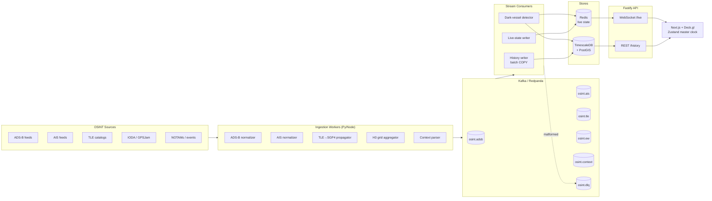
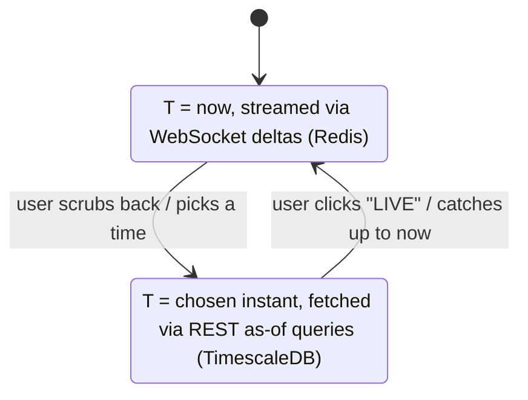
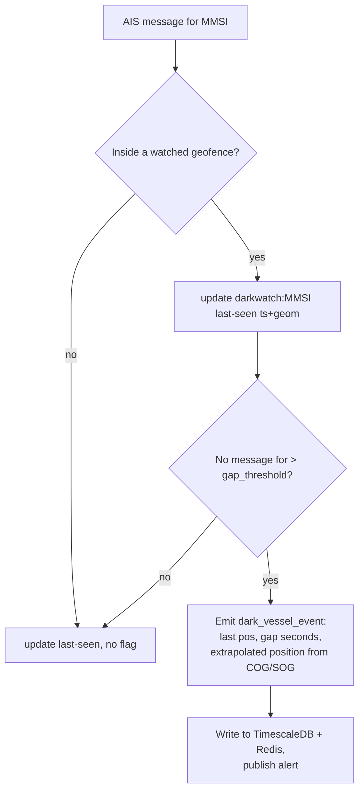

# WorldView — Architecture & Schema (STEP 1)

> The 4D OSINT command center: how the global firehose of air / sea / space / cyber telemetry becomes a single, time-scrubbable 3D globe.

This is the foundational design document for WorldView. It specifies the streaming ingestion
pipeline (Kafka), the temporal history store (TimescaleDB hypertables), the spatial model
(PostGIS), the live-state cache (Redis), and the **4D Playback Engine** that lets a single
master timestamp reconstruct the exact state of every layer at any instant — live or historical.

It corresponds to **STEP 1** of the five-step build plan. No service code is produced here;
the deliverable is this document plus the SQL DDL under [`../db/schema/`](../db/schema/).

---

## 1. Vision & scope

WorldView fuses multi-domain open-source intelligence onto one globe and adds a fourth
dimension — **time** — so an analyst can scrub backward and forward and watch every layer move
in lockstep. The reference use cases (after Sidhu's "God's Eye View"):

- **Defense / OSINT:** reconstruct strikes and troop movements, predict satellite recon windows.
- **Finance:** watch maritime choke points (Strait of Hormuz) to anticipate supply-shock and oil moves.
- **Journalism:** replay a geopolitical event minute-by-minute in a provable 4D format.

### The five data layers

| ID | Layer | Source examples | Cadence | Spatial primitive |
| --- | --- | --- | --- | --- |
| **A** | Aerospace (ADS-B) | OpenSky, ADSB.fi, mil feeds | 1–5 s/aircraft | 3D point (lon/lat/alt) |
| **B** | Maritime (AIS) | AISStream, terrestrial/sat AIS | 2 s–3 min/vessel | 2D point + heading |
| **C** | Space (TLE/SGP4) | Celestrak, Space-Track | propagated, materialized per minute | 3D point + footprint polygon |
| **D** | Cyber & EW | IODA (outages), GPSJam/ADS-B noise (jamming) | minutes | H3 hex polygons |
| **E** | Contextual Intel | FAA/Eurocontrol NOTAMs, OSINT events | event-driven | polygons + points |

The hard part is not any single layer — it is **coalescing heterogeneous cadences into one
queryable timeline** at a scale (millions of points) that still renders at 60fps. The rest of
this document is organized around that goal.

---

## 2. High-level architecture



**Flow in one sentence:** sources → workers normalize to a canonical envelope → Kafka buffers
and partitions per entity → consumers fan out to TimescaleDB (durable history) and Redis (live
snapshot + pub/sub) → Fastify serves REST history and WebSocket live → the Next.js client
drives every Deck.gl layer from one Zustand-held master clock.

### Why a broker at all

ADS-B + AIS together are a global firehose (tens of thousands of messages/second at peak).
Writing each message straight to Postgres would lock the write path and couple source outages
to query latency. Kafka **decouples** ingestion from storage: it absorbs bursts, lets us
replay, and lets multiple independent consumers (history, live cache, anomaly detection) read
the same stream at their own pace.

---

## 3. The normalized event envelope

Every worker maps its source format to one canonical envelope before publishing. Downstream
code therefore never needs to know whether a point came from OpenSky or ADSB.fi.

```jsonc
{
  "schema": "worldview.telemetry.v1",
  "domain": "adsb",            // adsb | ais | tle | ew | context
  "source": "opensky",         // provenance, for trust scoring + dedup
  "entity_id": "4ca7b3",       // icao24 | mmsi | norad_id | h3_index | event_id
  "ts": 1749200400.123,        // event time, UNIX seconds (float, ms precision)
  "ingested_at": 1749200400.456,
  "lon": 56.231,               // WGS84
  "lat": 26.512,
  "alt_m": 10668,              // nullable (sea level for vessels)
  "geom_wkt": null,            // optional: WKT for polygon-bearing events (footprints, NOTAMs)
  "payload": {                 // domain-specific fields, validated per domain schema
    "callsign": "UAE201",
    "gs_kt": 451,
    "track_deg": 118.4,
    "vert_rate_fpm": -640,
    "squawk": "2200",
    "on_ground": false,
    "is_military": false
  }
}
```

Design choices:

- **Event time vs ingest time are both kept.** The 4D engine keys on `ts` (when it happened);
  `ingested_at` is for latency monitoring and late-arrival handling.
- **`entity_id` is the partition key.** All messages for one aircraft/vessel/satellite land on
  the same Kafka partition, preserving per-track ordering without global ordering cost.
- **`payload` is an open object** validated by a per-domain JSON Schema registered in the
  schema registry, so the envelope stays stable while domains evolve.

---

## 4. Kafka ingestion pipeline

### 4.1 Topics

One topic per domain keeps consumers simple and lets us tune partitions/retention per velocity.

| Topic | Producers | Partition key | Suggested partitions | Broker retention |
| --- | --- | --- | --- | --- |
| `osint.adsb` | ADS-B workers | `icao24` | 24 | 24 h |
| `osint.ais` | AIS workers | `mmsi` | 12 | 24 h |
| `osint.tle` | TLE propagator | `norad_id` | 6 | 72 h |
| `osint.ew` | H3 aggregator | `h3_index` | 6 | 72 h |
| `osint.context` | context parser | `event_id` | 3 | 7 d |
| `osint.dlq` | all consumers | original key | 3 | 14 d |

Broker retention is short because TimescaleDB is the system of record — Kafka is a buffer, not
the archive. The longer DLQ retention gives operators time to inspect and replay poison messages.

### 4.2 Partitioning rationale

Partition count is sized to peak throughput and consumer parallelism, not vanity. ADS-B is the
heaviest stream, so it gets the most partitions (24) to allow a 24-way-parallel history writer.
Keying on `entity_id` guarantees that the sequence of positions for a single track is **ordered
within its partition**, which the "last-known-state" reconstruction (§8) depends on.

### 4.3 Schema registry & validation

A schema registry (Confluent SR or Redpanda's built-in) holds the envelope schema plus one
payload schema per domain. Producers validate before publish; the history-writer consumer
re-validates on consume. Anything that fails validation is routed to `osint.dlq` with the
original key and an error annotation, never silently dropped.

### 4.4 Consumer groups

Independent consumer groups read each topic at their own offset:

- **`history-writer`** — buffers messages and writes to TimescaleDB via batched `COPY`
  (micro-batches of ~5k rows or 500ms, whichever first). Batching is what makes high-volume
  inserts survivable.
- **`live-writer`** — upserts the latest state per entity into Redis and publishes a delta on a
  pub/sub channel for the WebSocket layer. Idempotent (last-write-wins by `ts`).
- **`dark-vessel-detector`** — stateful consumer of `osint.ais` that maintains per-vessel
  last-seen state and emits `dark_vessel_events` (see §9.1).

### 4.5 Delivery semantics & backpressure

- **At-least-once** is the default. The history writer is idempotent because the primary key is
  `(entity_id, ts)` — a replayed message becomes an `ON CONFLICT DO NOTHING`. We deliberately
  avoid the throughput cost of exactly-once: at-least-once + idempotent upsert gives the same
  observable result for this workload.
- **Backpressure** is handled by Kafka itself: if a consumer falls behind, lag grows but
  producers and sources are unaffected. Consumer lag per group is the primary scaling alarm.

---

## 5. TimescaleDB hypertable design

TimescaleDB partitions large tables into **chunks** by time (and optionally space), so a query
like *"every aircraft position between 03:10 and 03:15 yesterday"* touches only the relevant
chunks instead of scanning a monolithic table. This is what makes the 4th dimension fast.

| Hypertable | Time column | Chunk interval | Space partition | Rationale |
| --- | --- | --- | --- | --- |
| `adsb_positions` | `ts` | 1 hour | `icao24` (4 partitions) | highest velocity; small chunks keep recent queries hot |
| `ais_positions` | `ts` | 6 hours | `mmsi` (4 partitions) | high volume, lower cadence than ADS-B |
| `satellite_ephemeris` | `ts` | 1 day | none | regular, predictable, materialized rate |
| `gps_jamming` | `ts` | 1 day | none | already spatially aggregated into H3 cells |
| `internet_outages` | `ts` | 1 day | none | low cardinality (country/ASN) |
| `geopolitical_events` | `ts` | 7 days | none | sparse, event-driven |

Chunk interval is tuned per velocity: the rule of thumb is that the most recent chunk(s) should
fit comfortably in memory. Hot, high-rate streams (ADS-B) get small chunks; sparse streams get
large ones to avoid chunk-count bloat. Reference tables (§ `01_reference.sql`) are **not**
hypertables — they are slowly-changing dimensions joined to the fact streams by `entity_id`.

See [`../db/schema/`](../db/schema/) for the full DDL; column-level details below in §6.

---

## 6. PostGIS geometry model

| Use | Type | Why |
| --- | --- | --- |
| Aircraft / vessel / satellite position | `geometry(PointZ, 4326)` | 3D point carries altitude in Z; SRID 4326 = WGS84 lon/lat |
| Satellite sensor footprint | `geometry(Polygon, 4326)` | optical cone or SAR swath projected to ground |
| H3 jamming / blackout cell | `geometry(Polygon, 4326)` | the hexagon boundary for rendering + spatial joins |
| Geofence / choke point | `geometry(MultiPolygon, 4326)` | e.g. Strait of Hormuz operating area |
| NOTAM / strike zone | `geometry(Polygon, 4326)` | affected airspace/area |
| Proximity & distance math | cast to `geography` | great-circle distance in meters (dark-vessel gap, geofence containment) |

**`geometry` vs `geography`:** we store as `geometry(…,4326)` (cheap to index with GiST, fast
for bounding-box and rendering) and **cast to `geography`** only where true ellipsoidal distance
matters — dark-vessel gap distance and choke-point containment. This is the standard PostGIS
trade-off: planar ops for the hot path, geodesic ops where accuracy is required.

Every geometry column gets a **GiST index** (§ `08_indexes.sql`) so viewport (bounding-box)
queries from the map stay sub-millisecond.

---

## 7. Redis live-state model

Redis holds only the **present** — the most recent known state of every live entity — so the
WebSocket layer can answer "what's on the globe right now" without touching Postgres.

| Key pattern | Type | Contents | TTL |
| --- | --- | --- | --- |
| `live:adsb:{icao24}` | Hash | latest envelope fields for one aircraft | 60 s |
| `live:ais:{mmsi}` | Hash | latest vessel state | 600 s |
| `live:sat:{norad}` | Hash | latest propagated satellite point + footprint ref | 120 s |
| `geo:adsb` | Geo set | `GEOADD` of all live aircraft for radius/viewport queries | — (members expire via sweeper) |
| `geo:ais` | Geo set | live vessels | — |
| `chan:adsb` / `chan:ais` / … | Pub/Sub | per-domain delta channel feeding WebSockets | — |
| `darkwatch:{mmsi}` | Hash | last-seen ts + geom for in-geofence vessels (detector working set) | 2× expected gap |

The TTL **is** the liveness window: if a source stops reporting an aircraft, its `live:` key
expires and it drops off the globe automatically — no reaper needed for the hashes. A
lightweight sweeper prunes stale members from the geo sets. When the `live-writer` consumer
updates a key it also `PUBLISH`es the delta; the Fastify WebSocket layer subscribes and forwards
to connected clients.

---

## 8. The 4D Playback Engine (core challenge)

The whole platform is organized around one idea: **a single master UNIX timestamp `T` fully
determines what is drawn.** The client holds `T` in Zustand; every layer is a pure function of
`T`. There are two regimes.



### 8.1 Live mode

`T = now`. On connect the client pulls a **snapshot** of every `geo:*` set + `live:*` hash from
Redis (one REST call per layer), then subscribes to the WebSocket. Thereafter it applies
**deltas** as the `live-writer` publishes them. The master clock advances in real time.

### 8.2 Historical mode — "as-of T" reconstruction

When the user scrubs to a past instant, each layer is reconstructed as the **last-known state
at or before T** for every entity. For point layers this is a classic `DISTINCT ON`:

```sql
-- Every aircraft's position as of the chosen instant, within the current viewport.
SELECT DISTINCT ON (icao24)
       icao24, ts, geom, alt_m, gs_kt, track_deg
FROM   adsb_positions
WHERE  ts <= to_timestamp(:T)
  AND  ts >  to_timestamp(:T) - INTERVAL '2 minutes'   -- liveness window: ignore stale tracks
  AND  geom && ST_MakeEnvelope(:w, :s, :e, :n, 4326)   -- viewport bbox, GiST-indexed
ORDER BY icao24, ts DESC;
```

The `(icao24, ts DESC)` composite index (§ `08_indexes.sql`) makes the `DISTINCT ON` a cheap
index scan; the viewport bound limits it to on-screen entities; the lower time bound drops
tracks that have gone silent (so a plane that landed an hour ago doesn't hang in mid-air).

The same pattern serves each layer:

- **Flights / vessels** — `DISTINCT ON (entity_id)` point as above.
- **Satellites** — `DISTINCT ON (norad_id)` from `satellite_ephemeris`, returning both the
  point and the precomputed footprint polygon valid at `T`.
- **Jamming / blackout** — H3 cells whose validity interval contains `T` (the cell rows carry a
  time bucket; we select the bucket covering `T`).
- **NOTAMs / events** — rows where `effective_from <= T <= effective_to` (interval containment).

### 8.3 Staying at 60fps while scrubbing

A naive scrub would fire a full query per frame. Three mechanisms prevent that:

1. **Adaptive downsampling via continuous aggregates.** When zoomed out or scrubbing fast, the
   client requests pre-rolled buckets (1-min / 1-hr position summaries from
   TimescaleDB continuous aggregates, § `07_policies.sql`) instead of raw points — orders of
   magnitude fewer rows.
2. **Viewport + LOD culling.** Queries are always bounded by the map bounding box, and feature
   density is capped per tile by level-of-detail.
3. **Client-side interpolation & debounced fetch.** Between fetched keyframes, Deck.gl
   interpolates entity positions on the GPU; the scrub fetch is debounced so dragging the
   slider issues at most a few queries per second, not one per frame.

### 8.4 One clock, all layers

Because every layer subscribes to the same Zustand `masterTime`, toggling live/historical or
moving the slider updates flights, ships, satellite cones, and blackout hexagons **in a single
coherent frame**. Layer fetchers are keyed by `(layerId, T, viewport)` and memoized, so
unchanged layers don't refetch when only one toggles.

---

## 9. Per-layer algorithm notes (implemented in STEP 3)

These are design-level; the worker code lands in STEP 3.

### 9.1 Dark Vessel Detection (Layer B)

A "dark vessel" is a ship that **stops transmitting AIS while inside a sensitive geofence** —
the classic sanctions-evasion / pre-incident signature.



The `dark-vessel-detector` consumer keeps a `darkwatch:{mmsi}` working set in Redis for vessels
currently inside a geofence. A sweeper (or Redis keyspace expiry) detects when a vessel's
last-seen exceeds the gap threshold (geofence-specific, e.g. 30 min for Hormuz) and emits a
`dark_vessel_events` row with the last known position, the gap duration, and a dead-reckoned
**extrapolated** position (project last `geom` along last `cog`/`sog` for the elapsed gap). The
event participates in the timeline like any other layer.

### 9.2 TLE / SGP4 propagation & footprints (Layer C)

The TLE worker fetches two-line element sets (Celestrak/Space-Track), stores them in
`tle_catalog`, and **propagates** each satellite with SGP4 (e.g. `sgp4` in Python or
`satellite.js` in Node) at a fixed cadence (e.g. one point/minute), materializing results into
the `satellite_ephemeris` hypertable. For each propagated point it derives a **sensor footprint
polygon**:

- **Optical** (Maxar) → a cone/ellipse on the ground from nadir + look angle + field of view.
- **SAR** (Capella) → a side-looking **swath** rectangle offset from nadir.
- **SIGINT/other** (Topaz) → a broad coverage circle.

Footprint parameters live in `sensors_footprint_params` (§ `01_reference.sql`), so the geometry
generator is data-driven per satellite. Materializing ephemeris (rather than propagating on
read) is what lets historical scrubbing of satellites use the same fast `DISTINCT ON` path.

### 9.3 H3 jamming / blackout grids (Layer D)

Point observations of GPS interference and the country/region signals from IODA are aggregated
into **Uber H3** hexagons. The worker assigns each observation to an H3 cell (target resolution
~**r5** ≈ 8 km edge — a balance between spatial fidelity and render count), accumulates intensity
+ sample count per `(h3_index, time_bucket)`, and writes the cell polygon (`h3_index → boundary`)
to `gps_jamming` / derives `internet_outages` region geometry. Time-bucketing the cells lets the
4D engine pick the bucket covering `T`.

If the native PostgreSQL `h3` extension is unavailable, cells are computed app-side and the
`h3_index` is stored as text with the precomputed boundary polygon — so the schema works either way.

---

## 10. Retention, compression & downsampling

TimescaleDB native policies (§ `07_policies.sql`) implement a hot → warm → cold lifecycle:

| Tier | Age | Mechanism | Purpose |
| --- | --- | --- | --- |
| Hot | 0–48 h | raw, uncompressed chunks | live + recent scrubbing at full fidelity |
| Warm | 2 d – 90 d | **compression policy** (columnar, ~10–20× smaller) | historical replay, still queryable |
| Cold rollup | any age | **continuous aggregates** (1-min, 1-hr buckets) | fast long-range / zoomed-out scrubbing |
| Expiry | > retention | **retention policy** drops old raw chunks | bound storage; rollups survive |

The continuous aggregates double as the downsampling source for §8.3, so long-range timeline
views read pre-rolled buckets even after the raw chunks are dropped.

---

## 11. Architecture Decision Records

| # | Decision | Choice | Rationale |
| --- | --- | --- | --- |
| ADR-1 | Ingest path | **Kafka broker** in front of the DB | decouples firehose from storage, enables replay + multi-consumer fan-out; direct-to-DB would lock the write path |
| ADR-2 | History store | **TimescaleDB** over vanilla Postgres | chunk-based time partitioning makes "as-of T" + range scans fast; built-in compression, retention, continuous aggregates |
| ADR-3 | Spatial storage | **`geometry(…,4326)`**, cast to `geography` on demand | planar GiST indexing for the hot render path; geodesic accuracy only where it matters |
| ADR-4 | Render engine | **Deck.gl + Mapbox** over Cesium | industry standard for millions of points @ 60fps; H3/path/scatter layers out of the box |
| ADR-5 | Delivery semantics | **at-least-once + idempotent upsert** (`PK (entity_id, ts)`) | exactly-once's cost is unjustified when the sink is naturally idempotent |
| ADR-6 | EW grid | **Uber H3 ~r5** | uniform global hexagons, cheap aggregation, native render layer; resolution balances fidelity vs point count |
| ADR-7 | Satellite state | **materialized ephemeris** vs propagate-on-read | lets historical satellite scrubbing reuse the same fast `DISTINCT ON` path as flights/ships |

---

## 12. Build roadmap & gate

| Step | Deliverable | Status |
| --- | --- | --- |
| **1** | Architecture & schema (this doc + SQL DDL) | ✅ done |
| **2** | Monorepo scaffold (`frontend`, `backend-api`, `ingestion-workers`) + local infra | ✅ done |
| **3** | Ingestion workers (SGP4, H3, AIS/ADS-B normalizers, dark-vessel detector) | ✅ done |
| **4** | 4D API (Fastify REST `/history` + WebSocket `/live`; Redis live + TimescaleDB history) | ✅ done |
| 5 | Frontend (Next.js, Deck.gl map, timeline scrubber, Zustand sync) | ⏳ next |

The scaffold wires the skeleton for STEPs 3–5: the canonical envelope schema, the
`TelemetryProducer` + `DOMAIN_TOPICS` map, the Fastify bootstrap with the Redis/TimescaleDB
connection factories, and the Zustand master-time store — each marked where the real logic lands.

### Cross-reference: doc ↔ schema

| Section | SQL file |
| --- | --- |
| §6 extensions | `db/schema/00_extensions.sql` |
| §5 reference tables, §9.2 footprint params | `db/schema/01_reference.sql` |
| Layer A | `db/schema/02_aerospace_adsb.sql` |
| Layer B + §9.1 | `db/schema/03_maritime_ais.sql` |
| Layer C + §9.2 | `db/schema/04_space_tle.sql` |
| Layer D + §9.3 | `db/schema/05_cyber_ew.sql` |
| Layer E | `db/schema/06_context_intel.sql` |
| §10 policies, §8.3 aggregates | `db/schema/07_policies.sql` |
| §6 / §8 indexes | `db/schema/08_indexes.sql` |
