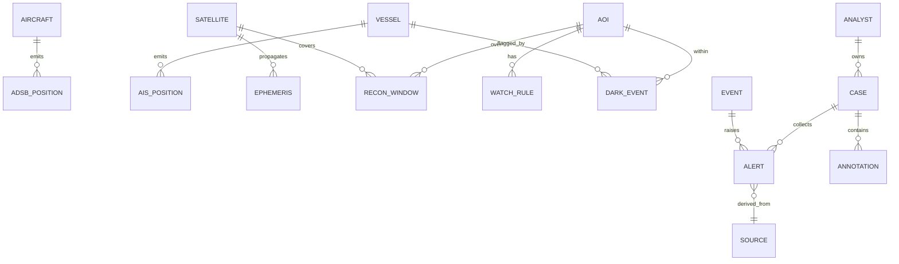

# WorldView — Platform Architecture & Delivery Plan (v1)

> The refined, build-grade plan behind [`ROADMAP.md`](ROADMAP.md). Where the roadmap says *what*
> and *why*, this says *how* — target architecture, a quantified scalability model, deep component
> designs, reliability/security/observability, deployment topologies (standalone **and**
> JARVIS-embedded), and a sequenced delivery plan with measurable exit criteria.
>
> Audience: engineers building it and reviewers gating it. Companion to
> [`01-architecture-and-schema.md`](01-architecture-and-schema.md) (the STEP 1 data design,
> already implemented). This document supersedes nothing; it *extends* that to production scale.

---

## 0. Engineering tenets

1. **Decouple ingestion from serving.** A source outage or a query storm must never affect the other. The broker is the shock absorber.
2. **Event time is truth.** Everything keys off `ts` (when it happened), never wall-clock arrival. The platform is bitemporal (event time vs ingest time).
3. **Idempotent everywhere.** At-least-once delivery + idempotent sinks (`PK (entity_id, ts)`, `ON CONFLICT DO NOTHING`). Replays are safe by construction.
4. **Degrade, don't fail.** Missing rollup → raw fallback (already shipped). Missing source → stale-but-labeled. Overload → shed load with backpressure, never crash.
5. **Provenance is a first-class column, not an afterthought.** Every datum carries `source` + `ingested_at`; every derived insight links to the signals that produced it.
6. **Scale horizontally on the hot paths, vertically on the store.** Stateless API/WS/consumers scale out; TimescaleDB scales up + read replicas + functional sharding + lakehouse offload.
7. **Local-first integration.** As a JARVIS capability, WorldView is an **opt-in, gated, auditable** plugin — never required by core, public-OSINT-only.

---

## 1. Non-functional requirements (SLOs)

| Dimension | Target (standalone prod) | Notes |
| --- | --- | --- |
| **Ingest throughput** | 100k msg/s sustained, 150k peak | ADS-B + AIS dominate (§3.1) |
| **Live latency** (source → WS client) | p95 < 2 s, p99 < 5 s | end-to-end across broker + writer + Redis + WS |
| **Historical query** (as-of-T, viewport) | p95 < 300 ms, p99 < 800 ms | viewport-bounded, indexed; LOD for zoomed-out |
| **MCP tool call** (via JARVIS) | p95 < 500 ms | state/query tools; long ops are async jobs |
| **Recon-window alert lead time** | ≥ configurable (default 15 min) | correctness, not latency |
| **API availability** | 99.9 % (≤ 43 min/mo) | multi-AZ, N+1 replicas |
| **Ingestion availability** | best-effort + replay | sources are inherently flaky; Kafka retains for replay |
| **Durability (history)** | RPO ≤ 5 min, RTO ≤ 30 min | WAL streaming + Kafka replay |
| **Data freshness (rollups)** | continuous aggregates ≤ 2 min behind | refresh policy |
| **Cost envelope** | linear with ingested volume | tiered storage + downsampling keep $/event flat |
| **Security** | OIDC + RBAC/ABAC, audited, egress-controlled | §7 |

These SLOs are the acceptance bar for "Phase A done at scale" and the inputs to capacity (§3).

---

## 2. Target reference architecture

A C4-ish container view of the **to-be** platform. Bold tiers are new/expanded vs today.

```mermaid
flowchart TB
    subgraph Sources["OSINT sources (untrusted, flaky)"]
        S1[ADS-B feeders]; S2[AIS terrestrial+sat]; S3[Celestrak/Space-Track]
        S4[IODA / GPSJam]; S5[NOTAM/event feeds]
    end

    subgraph Edge["Ingestion tier (stateless, KEDA-scaled)"]
        I1[ADS-B worker]; I2[AIS worker]; I3[TLE propagator]
        I4[EW/H3 aggregator]; I5[Context parser]
        SR[(Schema Registry)]
    end

    subgraph Bus["Streaming backbone — Kafka/Redpanda (tiered storage → S3)"]
        T[(osint.* topics + DLQ + tiered)]
    end

    subgraph SP["Stream processing (stateful, exactly-once-ish)"]
        C1[history-writer]; C2[live-writer]; C3[dark-vessel detector]
        C4[**CEP / tipping-cueing engine**]; C5[**enrichment/ontology projector**]
    end

    subgraph Store["Storage"]
        TS[(TimescaleDB primary<br/>hot+warm+caggs)]
        TSR[(read replicas)]
        RD[(Redis live + pub/sub)]
        GR[(graph projection)]
        LK[(lakehouse: Parquet/Iceberg on S3<br/>cold raw + analytics)]
    end

    subgraph Serve["Serving tier (stateless, HPA-scaled)"]
        API[REST /history, /track, /aoi, /recon]
        WS[**WS gateway fleet** (fan-out, viewport-filtered)]
        TILE[**vector-tile service** (Martin/pg_tileserv + CDN)]
    end

    subgraph AI["Insight / AI tier"]
        RW[**Recon-window scheduler**]
        AL[**Alerting & notification pipeline**]
        MCP[**WorldView MCP server**]
    end

    subgraph Clients
        FE[Next.js + Deck.gl]
        JV[**JARVIS** (agents, autonomy, KG)]
        EXT[3rd-party API consumers]
    end

    Sources --> Edge --> Bus --> SP
    Edge -. validate .-> SR
    C1 --> TS; C2 --> RD; C3 --> TS; C3 --> RD
    C4 --> TS; C4 --> AL; C5 --> GR
    TS --> TSR
    TS -. CDC/sink .-> LK
    TSR --> API; TS --> API; RD --> WS; TS --> TILE
    RW --> TS; RW --> AL
    API --> FE; WS --> FE; TILE --> FE
    API --> MCP; RW --> MCP; AL --> MCP
    MCP --> JV; AL --> JV; GR --> JV
    API --> EXT
```

**What's already built** (PR #163): the ingestion workers, the broker design, history/live writers, the
dark-vessel detector, TimescaleDB schema + caggs + policies, REST `/history` + `/track`, the WS `/live`
with viewport filter, the LOD path, Redis live-state, and the Deck.gl client. **What this plan adds:**
the CEP/tipping-cueing engine, the ontology projector + graph, the recon-window scheduler, the alerting
pipeline, the WS gateway *fleet*, the vector-tile service, the lakehouse offload, read replicas, and the
MCP server + JARVIS integration.

### Build-vs-buy at each tier
| Tier | Choice | Rationale / alternative |
| --- | --- | --- |
| Broker | **Redpanda** (Kafka API) | single binary, tiered storage to S3, no ZK; alt: Kafka+Tiered Storage / MSK |
| Stream processing | **start custom consumers**, graduate to **Flink/Materialize** for CEP | we own the consumer infra; CEP windowing/late-data is where managed stream-SQL earns its keep |
| Time-series store | **TimescaleDB** (single primary + replicas) | hypertables/caggs/compression already proven in CI; multi-node TS is EOL → scale via replicas + functional shard + lakehouse |
| Cold analytics | **Iceberg/Parquet on S3 + DuckDB/Trino** | cheap infinite retention + ad-hoc analytics without loading the OLTP store |
| Live cache + bus | **Redis** (cluster) | live-state + pub/sub; alt for very high WS fan-out: NATS / Centrifugo |
| Tiles | **Martin** or **pg_tileserv** + CDN | serve MVT vector tiles for huge viewports instead of raw GeoJSON |
| Identity | **OIDC** (Keycloak/Auth0) | RBAC/ABAC; in JARVIS mode, reuse JARVIS capability tokens |
| Telemetry | **OpenTelemetry → Prometheus/Tempo/Loki/Grafana** | vendor-neutral; alt: Datadog |

---

## 3. Capacity & scalability model (quantified)

### 3.1 Workload characterization
| Stream | Cardinality (peak) | Effective rate | Daily events | Notes |
| --- | --- | --- | --- | --- |
| ADS-B | ~15k aircraft airborne | ~15k msg/s sustained, ~30k peak | ~1.3 B/day | state vectors at ~1 Hz; raw Mode-S would be ~2–3× |
| AIS | ~70k vessels w/ transceiver | ~20k–40k msg/s | ~1.7–3 B/day | terrestrial (coastal-dense) + satellite |
| TLE/ephemeris | ~500–2000 curated sats | materialized 1/min | ~10–30 rows/s | trivial volume, CPU-bound (SGP4) |
| EW/H3 + context | sparse | < 100 msg/s | < 10 M/day | aggregated upstream |
| **Total** | — | **~50k sustained / ~100–150k peak** | **~3–4 B events/day** | the design point |

### 3.2 Broker (Kafka/Redpanda)
- **Partitioning** = max(throughput need, consumer parallelism). ADS-B `osint.adsb`: **48 partitions** → at 30k msg/s = ~625 msg/s/partition (headroom to 5–10k). AIS: **24**. TLE/EW/context: **6/6/3**. Key = `entity_id` (per-track ordering).
- **Sizing:** ~3.5 B events/day × ~200 B wire = ~700 GB/day. At **RF=3** and **24 h** local retention = ~2.1 TB hot broker storage; **tiered storage** offloads older segments to S3 so local disk stays bounded. DLQ retention 14 d.
- **Scale knob:** add partitions + consumer instances; **KEDA** autoscales consumers on **consumer-group lag**.

### 3.3 Stream processing
- Each consumer group scales to ≤ partition count. history-writer batches (≈5k rows / 500 ms) → at 50k msg/s that's ~10 COPY batches/s/instance; 24 instances ≫ enough. **Backpressure** is intrinsic: lag grows, sources unaffected; **lag is the master scaling alarm** (KEDA target e.g. < 60 s).
- CEP engine (§5.2) is stateful (windowed) → partition state by `aoi_id`/`geohash`; checkpoint to RocksDB/S3 (Flink) or compacted Kafka topic (custom).

### 3.4 TimescaleDB (the store)
- **Ingest:** ~3.5 B rows/day ≈ ~40k rows/s avg → batched COPY easily sustains this on NVMe; partition by `entity_id` (4 space partitions) spreads write locks.
- **Storage math:** ~150 B/row uncompressed → ~525 GB/day raw; **columnar compression ~12–18×** → **~30–45 GB/day** warm. **90-day** warm ≈ **3–4 TB** compressed. Continuous aggregates (1-min) shrink long-range reads ~30–60×.
- **Read scale:** viewport + as-of-T queries hit GiST + `(entity_id, ts DESC)` indexes (sub-ms index scans). **Read replicas** absorb the API read fan-out; the primary is write-dedicated. Hot dashboards hit replicas; the writer hits primary.
- **Beyond a single node** (TimescaleDB multi-node is EOL): three-pronged scale path —
  1. **Vertical**: large NVMe node (these workloads fit comfortably on one big primary for a long time).
  2. **Read replicas** (N) for read throughput + HA failover.
  3. **Functional/geographic sharding** at the app layer (e.g., per-region clusters) + a **lakehouse offload** (CDC/sink to **Iceberg/Parquet on S3**) for cold raw + ad-hoc analytics via DuckDB/Trino — keeps the OLTP store lean.
- **Lifecycle:** hot (0–48 h, uncompressed, NVMe) → warm (2–90 d, compressed) → cold (caggs + Parquet) → retention drop of raw (already policy-coded in `07_policies.sql`, **validated in CI against real TimescaleDB**).

### 3.5 Redis + WebSocket fan-out (the real-time bottleneck)
- **Live keys:** ~85k entities × ~500 B = ~45 MB + geo sets → memory is trivial (< 1 GB); **write rate** (~85k upserts / few s) and **pub/sub fan-out** are the load. Redis sustains 100k+ ops/s; **cluster** by layer/keyspace if needed.
- **WS gateway fleet:** the hard part is **N clients × delta rate**. Mitigations, in order: (1) **server-side viewport filtering** (built — only in-view deltas), (2) **coalescing** (≤ 4 Hz per entity, send latest), (3) **horizontal WS gateways** (cap ~10–30k conns/node; each subscribes to Redis/NATS and fans out), (4) **channel sharding by geohash/layer** so a gateway only subscribes to relevant shards. For very high N, swap Redis pub/sub for **NATS** or **Centrifugo** (purpose-built fan-out).
- **Connection budget:** API/WS use bounded pg pools (e.g., 20/instance) behind **PgBouncer** (transaction pooling) so 100s of API replicas don't exhaust Postgres connections.

### 3.6 Scale-knob summary
| Pressure | Knob |
| --- | --- |
| Ingest msg/s ↑ | + Kafka partitions, + consumer instances (KEDA on lag) |
| Query QPS ↑ | + read replicas, + API replicas (HPA), tile cache/CDN |
| WS clients ↑ | + WS gateways, viewport filter + coalescing, NATS fan-out, geohash channel shards |
| History volume ↑ | compression + retention + caggs; lakehouse offload; functional shard |
| CEP complexity ↑ | move custom consumer → Flink/Materialize; partition state by AOI |

---

## 4. Data architecture

### 4.1 Envelope evolution & schema governance
- The canonical `worldview.telemetry.v1` envelope (built) gains a **schema registry** (Redpanda SR / Confluent) with **backward-compatible** evolution (`v1` → `v1.1` additive only). Producers validate on publish; the history-writer re-validates on consume; failures → DLQ with annotation (never silent drop). Version pinned in the envelope (`schema` field).
- **Bitemporality:** keep `ts` (event), `ingested_at` (ingest), and — for the ontology — `valid_from/valid_to` (assertion validity). Enables "what did we *know* at time T" vs "what was *true* at time T" (provenance + auditability).
- **Late/out-of-order:** TimescaleDB accepts out-of-order inserts into open chunks; the live path uses last-write-wins by `ts`. Watermarks in the CEP engine bound lateness (e.g., 60 s) before windows close.

### 4.2 The Ontology / object model (Palantir-pattern, our scale)
Promote the flat layer model to **objects + links + actions** — the semantic spine that makes the platform *reason about things*, and the contract synced to JARVIS's knowledge graph.



- **Object types:** `Aircraft, Vessel, Satellite, Sensor, AOI, ReconWindow, Event, DarkVesselEvent, Alert, Source, Case, Annotation, Analyst, WatchRule`.
- **Link types:** `observed_in, transits, covers, cued_by, flagged_by, derived_from, member_of_case, raised_by`.
- **Action types** (the kinetic layer — guarded, audited): `create_aoi, set_watch_rule, acknowledge_alert, annotate, open_case, export_case, mute_source`.
- **Implementation:** the OLTP relational tables remain the system of record; an **ontology projector** (stream-processing job `C5`) maintains a **graph projection** (objects + edges) in Postgres (recursive CTEs / `ltree`) or a graph store, and emits a **change feed** to JARVIS's KG (§5.4). Actions are API endpoints behind RBAC + audit.

### 4.3 Data quality & dedup
- Dedup at the sink (idempotent PK). Cross-feeder dedup for ADS-B (same `icao24` from multiple feeders within Δt) handled by last-write-wins on `(icao24, ts)`.
- Quality metrics: per-source freshness, drop rate, schema-violation rate, position sanity (impossible jumps) → quarantine flag, never hard-fail.

---

## 5. Component deep-dives

### 5.1 Recon-window prediction & alerting (the open-source MetaConstellation analogue)
**Goal:** for each AOI, predict when each satellite's sensor footprint will cover it, with quality (look angle, daylight for optical), and alert ahead of time.

**Algorithm (per AOI × satellite × horizon H):**
1. Coarse-propagate (SGP4, already built) at Δt=30 s over H (default 24 h); compute the sub-satellite point + footprint (built).
2. Flag intervals where `footprint ∩ AOI ≠ ∅` (PostGIS `ST_Intersects`).
3. Refine ingress/egress by **bisection** to ~1 s; compute **max elevation / min look-angle** and `is_sunlit` (built) at closest approach → a **quality score** per sensor type (optical needs daylight + low look-angle; SAR is night-capable, swath-offset).
4. Emit `ReconWindow(aoi, norad, t_ingress, t_egress, sensor_type, quality)` → `recon_windows` table (a materialized schedule), refreshed on TLE update (TLEs age ~ hours/days).

**Complexity:** AOIs × sats × (H/Δt). 50 AOIs × 1,500 sats × 2,880 steps ≈ 2.16×10⁸ cheap propagations/refresh — parallelizable, incremental (only re-propagate sats with new TLEs or AOIs that changed). Cache aggressively; this is embarrassingly parallel → scale by sharding (aoi_id, norad) across workers.

**Alerting:** a scheduler scans `recon_windows` for `t_ingress` within the AOI's `lead_time`; emits an `Alert` (§5.5). **This is the headline "wow" feature and reuses 100 % of the SGP4/footprint code already shipped.**

### 5.2 CEP / tipping-and-cueing & anomaly engine
**Goal:** turn the firehose into *insights*. Detect patterns across layers, in windows.

**Patterns (rules):**
- **Tipping-and-cueing ("passes stacking"):** ≥ N `ReconWindow`s over one AOI within Δt (Sidhu's headline, automated).
- **Dark-vessel** (built) + **dark-vessel ↔ recon-window correlation** (a vessel goes dark *and* a SAR pass is imminent → high-interest).
- **Airspace-closure cascade:** ≥ K NOTAMs activating in a region within Δt.
- **Jamming onset:** H3 intensity rising across ≥ M contiguous cells.
- **Blackout correlation:** IODA outage co-located/co-timed with a kinetic event.
- **Holding-pattern detection:** aircraft loitering (low net displacement, circular track) near an AOI.

**Implementation path:** start with **windowed Kafka consumers** (we own the infra) keyed by `aoi_id`/`geohash`, state in a compacted topic or RocksDB; **graduate to Flink or Materialize** when rules multiply (declarative windowed SQL, exactly-once, late-data handling pay off). Output: `Event` + `Alert` objects with **provenance links to the contributing signals** (so every insight is explainable — tenet #5).

### 5.3 The 4D query engine at scale
- **As-of-T** (`DISTINCT ON … WHERE ts ≤ T`) + **LOD caggs** + **graceful raw fallback** — all **built & CI-validated**.
- **Add for huge viewports:** **MVT vector tiles** (Martin/pg_tileserv) behind a **CDN** — render millions of points as tiles instead of shipping GeoJSON; the client switches to tiles below a zoom threshold (parallel to the existing `lod=minute` switch).
- **Add for extreme density:** optional **server-side aggregation** (H3/hexbin) returned as tiles; the client already speaks H3.
- **Read isolation:** all serving reads hit **replicas** via PgBouncer; the writer owns the primary.

### 5.4 WorldView MCP server + JARVIS integration
**The integration linchpin — JARVIS as WorldView's local-first "AIP."**

```mermaid
sequenceDiagram
    participant U as User
    participant JV as JARVIS (agent + autonomy)
    participant MCP as WorldView MCP server
    participant API as WorldView API
    participant KG as JARVIS knowledge graph

    U->>JV: "alert me when a SAR satellite covers Hormuz"
    JV->>MCP: watch_aoi(aoi=Hormuz, rule=recon:SAR, lead=15m)   %% capability-token gated
    MCP->>API: create AOI + watch rule (RBAC + audit)
    Note over MCP,API: recon scheduler runs; a window approaches
    API-->>MCP: Alert(recon_window, Hormuz, SAR, t-15m)
    MCP-->>JV: alert event (provenance: norad, TLE epoch, footprint)
    JV->>JV: autonomy inbox → severity/budget (≤4/day) → digest
    JV-->>U: "Capella SAR pass over Hormuz in 14 min (provenance ↗)"
    JV->>KG: upsert objects/edges (AOI, ReconWindow, Alert)
```

- **Tools** (the MCP surface): `state_at(t, bbox, layers)`, `find_dark_vessels(aoi, window)`, `recon_windows(aoi, horizon)`, `watch_aoi(aoi, rules, lead)`, `reconstruct_event(t0, t1, bbox)`, `track_of(entity, window)`, `list_aois()`. Read tools are synchronous; `watch_*`/`reconstruct_*` are async (return a handle; results stream via alerts/events).
- **AuthN/Z:** JARVIS calls with a **capability token** (reuse the JARVIS `CapabilityBroker`, H17.3) — scoped, expiring, non-escalatable. WorldView enforces RBAC/ABAC + audits every call. The `plugin_gate` governs whether an agent may call at all.
- **Autonomy:** alerts flow into JARVIS `autonomy/` (inbox → severity → **≤ 4 urgent/day budget** → digest). This is the killer proactive loop.
- **Knowledge-graph sync:** the ontology change-feed upserts objects/edges into `memory/graph.py`; fused recall (RRF) answers geo-temporal questions tied to the rest of memory.
- **Boundaries:** opt-in plugin, never required by core; outbound OSINT fetches egress-gated + audited; strict-local agents never touch it; public OSINT only.

### 5.5 Alerting & notification pipeline
- **Stages:** detect (CEP/recon) → **dedup** (suppress repeats per `(rule, entity)` within cooldown) → **severity** (rule-weighted) → **budget** (JARVIS ≤4/day for urgent; the rest to digest) → **route** (channel: web/telegram/voice/MCP) → **ack/audit**.
- Every alert is an `Alert` object linked to its `Source`s (explainable). Snooze/mute as audited actions.

---

## 6. Reliability & resilience

| Failure mode | Mitigation |
| --- | --- |
| Source outage / flapping | Kafka decouples; stale-but-labeled in UI; auto-reconnect with backoff; replay on recovery |
| Poison message | per-row fallback in writer (built) + DLQ; CEP watermarks bound lateness |
| Consumer crash | consumer-group rebalance; idempotent sinks make redelivery safe; checkpointed CEP state |
| Primary DB loss | streaming replica promotion (RTO ≤ 30 min); Kafka replay rebuilds recent history (RPO ≤ 5 min) |
| Redis loss | live-state is ephemeral/rebuildable from the stream; WS clients re-snapshot on reconnect |
| Query storm | read replicas + PgBouncer + per-tenant rate limits + tile/CDN cache; LIMIT caps (built) |
| WS thundering herd | connection limits per gateway, jittered reconnect, snapshot rate-limit |
| Region failure | multi-AZ within region; cross-region DR via Kafka mirror + WAL ship (RTO/RPO per tier) |
| Schema drift | registry compatibility checks block bad producers at publish |

**Practices:** chaos drills (kill a consumer/replica), game-day DR restore, load tests to the SLOs in §1, error budgets gate releases.

---

## 7. Security, privacy & governance

- **Identity & access:** OIDC; **RBAC** (roles: viewer, analyst, admin) + **ABAC** (AOI/region scoping). In JARVIS mode, capability tokens (H17.3) + `plugin_gate`.
- **Provenance / chain-of-custody:** `source` + `ingested_at` on every datum; every derived `Event`/`Alert` links to contributing signals; bitemporal `valid_*`. Reproducible event reconstruction (the journalism/legal bar).
- **Audit:** append-only, hash-chained (reuse JARVIS **Merkle audit**, H4.10/H17.4) for every action + tool call + alert ack.
- **Egress control:** outbound OSINT fetches go through an **SSRF-guarded** allowlisted egress (reuse JARVIS `security/ssrf`); credentials in a secrets manager (Vault/KMS), never in env files in prod.
- **Multi-tenancy:** row-level security by tenant/AOI; per-tenant rate limits + quotas; isolated namespaces in k8s.
- **Supply chain:** SBOM, dependency scanning (already: Dependabot + CodeQL in the repo), image signing (cosign), pinned digests.
- **Dual-use ethics gate:** public-OSINT-only; analysis/reconstruction framing, not operational targeting; documented acceptable-use; the security-review skill gates changes.
- **Privacy/compliance:** data-residency options (regional clusters), GDPR posture for any user/account data (the OSINT itself is public), configurable retention.

---

## 8. Observability & SRE

- **Golden signals** per service (latency, traffic, errors, saturation); **RED** for request services, **USE** for resources.
- **OpenTelemetry** traces across source→broker→writer→store→API→WS (one trace id follows a datum); **Prometheus** metrics, **Tempo** traces, **Loki** logs, **Grafana** dashboards.
- **Key SLIs:** consumer-group **lag** (the master alarm), ingest rate, write batch latency, as-of-T p95, WS connected/delta-rate, cagg freshness lag, alert lead-time accuracy, source freshness/drop rate.
- **Error budgets** gate releases; **runbooks** per alert; on-call rotation; synthetic checks (`/ready`, a canary as-of-T query, a WS handshake — all already exist as primitives).

---

## 9. Deployment & infrastructure

Three first-class topologies (the dual-product reality):

**(a) Dev / single-host** — `docker compose` (infra + app overlay, both shipped). One command, full stack.

**(b) Standalone production** — Kubernetes:
- Namespaces per tier; **Helm** charts; **Terraform** for cloud infra (managed Postgres/Timescale or self-run on NVMe, MSK/Redpanda Cloud, ElastiCache/Redis, S3).
- **Autoscaling:** **HPA** (CPU/RPS) for API/WS/tiles; **KEDA** (Kafka lag) for consumers; cluster autoscaler for nodes.
- **Progressive delivery:** Argo Rollouts canary/blue-green; migrations gated (expand-contract, never destructive); the path-filtered CI (built) + integration job (built, validates schema vs real TimescaleDB) extend to a CD pipeline.
- **Multi-AZ** default; **multi-region** via Kafka mirror + replica DR for the highest tier.

**(c) JARVIS-embedded** — WorldView runs as a **companion service** beside JARVIS (its own process/containers), exposed only via the **MCP server** + a private API; JARVIS consumes it as a gated plugin. Strict-local deployments can run the *serving + a curated source set* on-prem; the heavy stream tier is optional (you can run WorldView read-only against a hosted history).

**FinOps:** cost scales with **ingested volume**; the levers (downsampling caggs, tiered/lakehouse storage, compression, retention) keep **$/event flat**. Track cost-per-active-AOI and cost-per-1k-WS-clients as unit economics.

---

## 10. Delivery plan

Five workstreams mapped to the roadmap phases, each with a **measurable exit gate**. Estimates in
engineer-weeks (ew) assume a small senior squad (2–3 eng) + part-time SRE; sequence top-to-bottom.

| WS | Scope (roadmap refs) | Exit gate (measurable) | Est. |
| --- | --- | --- | --- |
| **WS1 — Live data path at scale** (A1,A2) | Real ADS-B+AIS+TLE feeds; KEDA-scaled consumers; tiered broker; read replica + PgBouncer; load-test rig | Sustained **50k msg/s** ingest with consumer lag < 60 s; as-of-T p95 < 300 ms under load; a real 24-h replay | 6–8 ew |
| **WS2 — Insight engine** (B1,B2,B3,B4) | Recon-window scheduler; CEP tipping-cueing + 3 anomaly rules; annotation/callout layer | An AOI shows a correct **"SAR pass in N min"** alert and a **"passes stacking"** insight, each with provenance | 6–8 ew |
| **WS3 — JARVIS integration** (C1–C5) | MCP server (7 tools); plugin + capability-token auth; autonomy watcher → digest; KG sync | **Operate WorldView by talking to JARVIS**; a dark-vessel/recon alert reaches the JARVIS digest within budget, fully provenanced | 5–7 ew |
| **WS4 — Governance & collaboration** (D1–D4) | Ontology projector + graph; RBAC/ABAC + audit; cases/annotations/multi-user; export | Two analysts collaborate on a **case** with full audit + a reproducible exported reconstruction | 6–8 ew |
| **WS5 — Scale & platform hardening** (A5,D5,D6, infra) | Vector tiles + CDN; WS gateway fleet + NATS option; lakehouse offload; DR drill; SLO dashboards | Globe renders **1M+ points** at 60 fps via tiles; **10k concurrent WS**; DR restore meets RPO/RTO; SLOs green | 7–9 ew |

**Critical path & parallelism:** WS1 unblocks WS2 and WS5; WS2 unblocks WS3 (alerts to surface) and WS4 (insights to govern). WS3 (JARVIS) and WS4 (governance) can run in parallel after WS2 lands. WS5 is continuous, front-loaded with tiles + replicas.

**RACI (lightweight):** Architect (A) — this plan + ADRs + reviews; Backend squad (R) — WS1–WS4; SRE (R) — WS5 + observability + CD; JARVIS owner (C) — WS3 integration contract; Security (C) — §7 gates; Product (I) — exit-gate sign-off.

### Risk register
| Risk | Likelihood | Impact | Mitigation |
| --- | --- | --- | --- |
| Source ToS / rate-limit / cost (OpenSky, AISStream, Space-Track) | High | Med | multi-source failover, caching, respect limits, paid tiers budgeted; abstract behind the normalizer |
| WS fan-out cost at high client N | Med | High | viewport filter (built) + coalescing + NATS fan-out + geohash shards (§3.5) |
| TimescaleDB single-node ceiling | Med | High | replicas + functional shard + lakehouse offload (§3.4); load-test early (WS1) |
| CEP complexity creep | Med | Med | start custom, graduate to Flink/Materialize on a clear trigger; rules as data |
| Dual-use / ethics / legal | Low | High | OSINT-only, acceptable-use, audit, security-review gate (§7) |
| JARVIS principle tension (cloud sources vs local-first) | Med | Med | opt-in gated plugin, never core; egress-controlled; documented (§5.4) |
| Scope sprawl vs the two benchmarks | Med | Med | the roadmap's explicit "skip/park" list; phase gates |

---

## 11. Architecture Decision Records (key calls)

| # | Decision | Choice | Alternatives considered / why not |
| --- | --- | --- | --- |
| ADR-8 | Stream processing engine | **Custom consumers now → Flink/Materialize when CEP grows** | All-Flink upfront = premature ops cost; all-custom forever = reinventing windowing/exactly-once |
| ADR-9 | Scaling the time-series store | **Single primary + read replicas + functional shard + lakehouse offload** | TimescaleDB multi-node (EOL); Citus (no native time-series caggs); pure lakehouse (loses sub-300 ms OLTP) |
| ADR-10 | Big-viewport rendering | **MVT vector tiles + CDN** below a zoom threshold | Ship raw GeoJSON (bandwidth/CPU blowup); client-only decimation (still over-fetches) |
| ADR-11 | WS fan-out at scale | **Redis pub/sub now → NATS/Centrifugo + geohash channel shards** | One Redis pub/sub for all clients (fan-out ceiling); per-client polling (latency/cost) |
| ADR-12 | JARVIS integration boundary | **MCP server (separate process) + capability tokens** | In-process Python coupling (violates the separate-stack tenet + JARVIS local-first); raw REST only (loses agent-tool ergonomics) |
| ADR-13 | Cold storage | **Iceberg/Parquet on S3 + DuckDB/Trino** | Keep everything in Timescale (cost/perf); no archive (loses long-range analytics + audit replay) |
| ADR-14 | Semantic layer | **Lightweight ontology (objects+links+actions) over the relational SoR** | Full graph DB as SoR (operational overhead); stay flat (can't reason about objects / sync to JARVIS KG) |

---

## 12. Appendix — capacity quick-formulas
- **Partitions** ≥ `peak_msg_s / target_per_partition_msg_s` (target ~5–10k) and ≥ desired consumer parallelism.
- **Warm storage (TB)** ≈ `rows_per_day × bytes_per_row / compression × retention_days / 1e12`.
- **Cagg long-range reduction** ≈ `raw_rows_in_window / (entities × buckets_in_window)`.
- **WS gateways** ≈ `concurrent_clients / conns_per_gateway` (cap ~10–30k); **delta egress** ≈ `Σ_clients viewport_entities × coalesce_hz × bytes`.
- **Recon refresh cost** ≈ `AOIs × sats_with_new_TLE × (horizon / Δt)` propagations (parallel, incremental).
